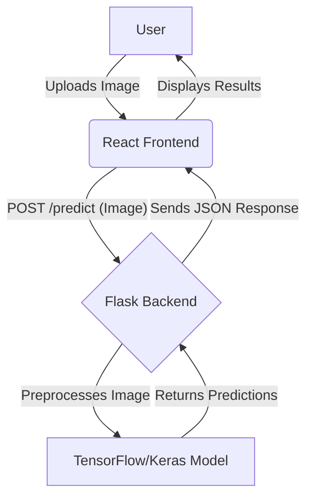
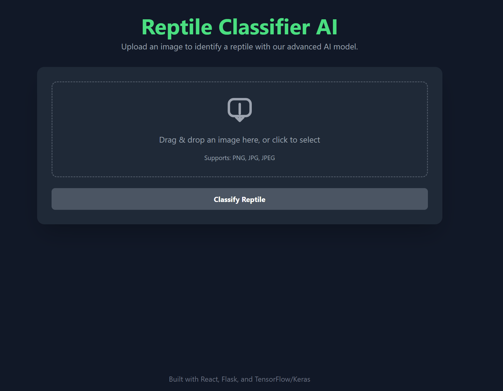
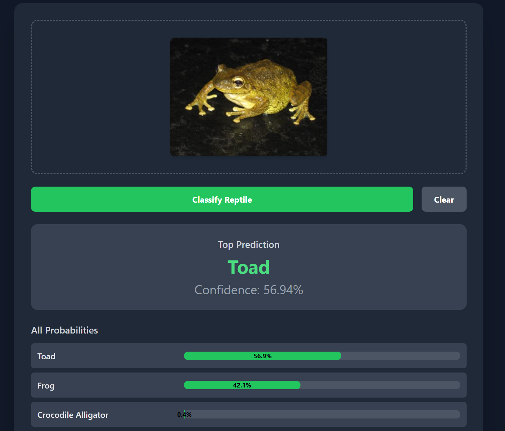
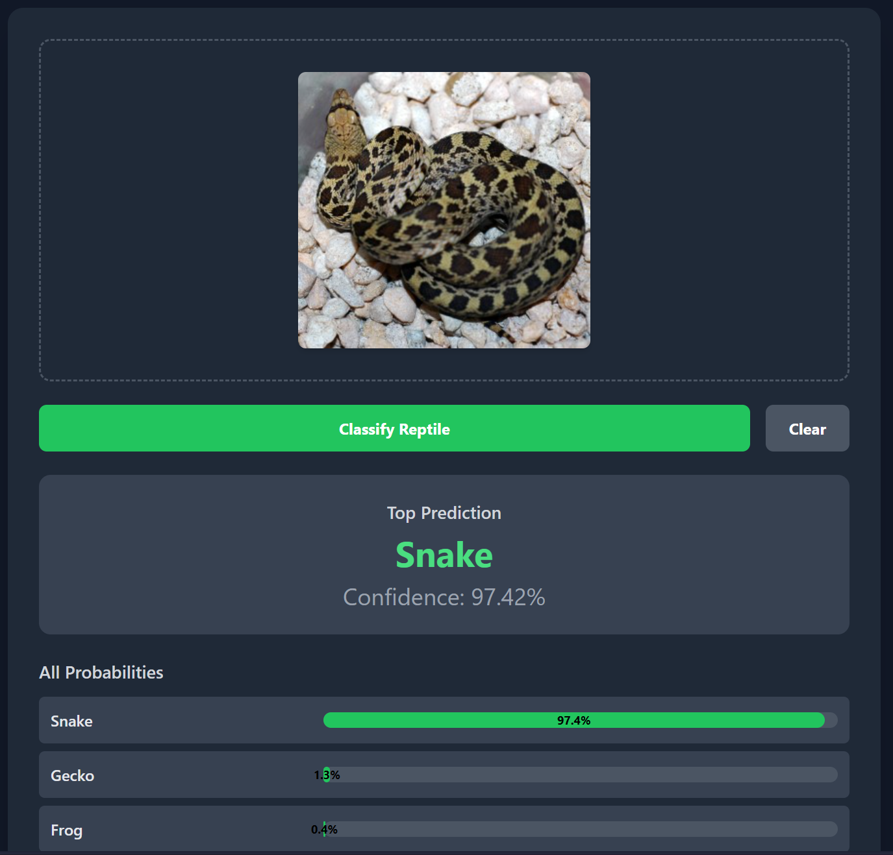
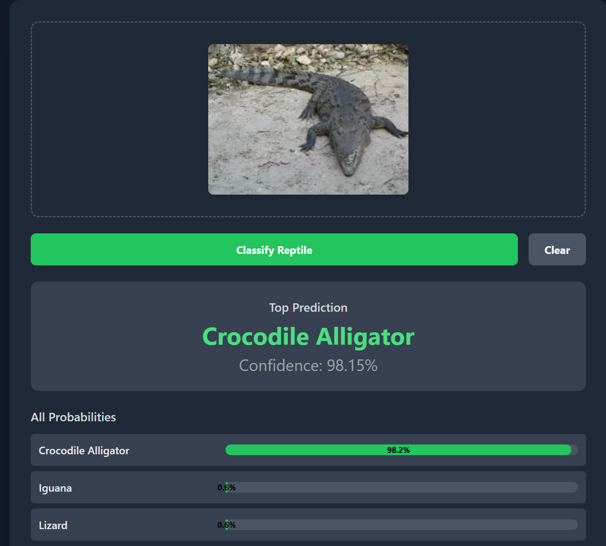

# Reptile Classifier AI 🦎

A full-stack web application that uses a deep learning model to classify images of reptiles. This project features a modern React frontend and a robust Flask backend for model serving.

---

## 🚀 Features

- **AI-Powered Classification:** Utilizes a TensorFlow/Keras model to classify 10 different reptile classes.
- **Modern UI:** A clean, responsive, and intuitive user interface built with React and styled with Tailwind CSS.
- **Drag & Drop Upload:** Easy image uploading with a drag-and-drop zone and a traditional file picker.
- **Real-time Previews:** Instantly see a preview of the uploaded image.
- **Detailed Predictions:** View the top prediction with a confidence score, plus a full list of probabilities for all classes.
- **Responsive Design:** Fully functional on both desktop and mobile devices.
- **RESTful Backend:** A scalable Flask API server handles model inference and serves predictions.

---

## 🛠️ Tech Stack

- **Frontend:** React, Tailwind CSS, Axios, React-Dropzone
- **Backend:** Flask, TensorFlow, Keras, Pillow
- **Language:** Python, JavaScript
- **Package Managers:** `pip`, `npm`

---

## 🏛️ System Architecture

The application uses a classic client-server architecture. The frontend and backend are decoupled, communicating via a RESTful API. This design allows for independent development, scaling, and maintenance.



---

## ⚙️ Setup and Installation

To run this project locally, please follow these steps carefully.

### Prerequisites

- **Python 3.8+** and `pip`
- **Node.js 16+** and `npm`
- **Git** for cloning the repository

### 1. Backend Setup (Terminal 1)

Follow these steps to get the backend server running.

```bash
# 1. Navigate to the backend directory
cd backend

# 2. Create and activate a Python virtual environment
# On macOS/Linux:
python3 -m venv venv
source venv/bin/activate

# On Windows:
python -m venv venv
.\venv\Scripts\activate

# 3. Install the required Python packages
pip install -r requirements.txt

# 4. Add the machine learning model
#    Place your `reptile_model.keras` file inside the `backend/model/` directory.
#
#    If you do not have a model file, you can generate a placeholder model by running:
python create_dummy_model.py

# 5. Start the Flask server
flask run

# The backend API is now running and listening at http://127.0.0.1:5000
```

**Leave this terminal running.**

### 2. Frontend Setup (Terminal 2)

**Open a new terminal window** and follow these steps to get the user interface running.

```bash
# 1. Navigate to the frontend directory from the project root
cd frontend

# 2. Install the required Node.js packages
npm install

# 3. Start the React development server
npm start

# The React application will automatically open in your default web browser.
# If it doesn't, you can access it at http://localhost:3000
```

You now have the full-stack application running! You can upload an image on the frontend to get a classification from the backend.





---

## 📋 API Endpoints

The Flask backend provides the following endpoints:

| Method | Endpoint   | Description                                    |
| ------ | ---------- | ---------------------------------------------- |
| `POST` | `/predict` | Accepts an image file and returns predictions. |
| `GET`  | `/health`  | Health check to confirm the server is running. |

---

## 🔮 Future Improvements

- **Containerization:** Use Docker and Docker Compose to containerize the frontend and backend for simplified deployment and environment consistency.
- **Model Scaling:** Deploy the model using a dedicated service like TensorFlow Serving or a cloud platform (e.g., AWS SageMaker) for better performance and scalability under high load.
- **Database Integration:** Add a PostgreSQL database to store prediction history for users and to collect data for model retraining.
- **CI/CD Pipeline:** Implement a CI/CD pipeline using GitHub Actions to automate testing and deployment on every push to the main branch.
